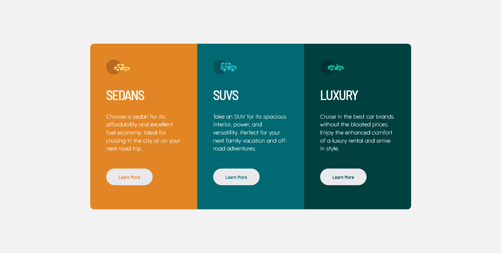
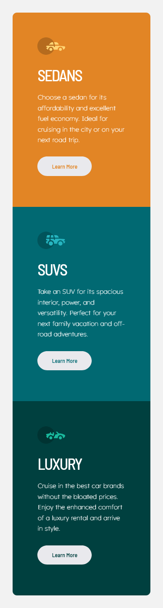

# Frontend Mentor - 3-column preview card component solution

This is a solution to the [3-column preview card component challenge on Frontend Mentor](https://www.frontendmentor.io/challenges/3column-preview-card-component-pH92eAR2-). Frontend Mentor challenges help you improve your coding skills by building realistic projects. 

## Table of contents

- [Overview](#overview)
  - [The challenge](#the-challenge)
  - [Screenshot](#screenshot)
  - [Links](#links)
- [My process](#my-process)
  - [Built with](#built-with)
  - [What I learned](#what-i-learned)
  - [Continued development](#continued-development)
  - [Useful resources](#useful-resources)
- [Author](#author)
- [Acknowledgments](#acknowledgments)

**Note: Delete this note and update the table of contents based on what sections you keep.**

## Overview
A three(3) column preview card component, built mainly with Flexbox, and other CSS tools. 

### The challenge
The Challenge was to build the 3 column preview card component provided in the desig folders
Users will be able to:
- View the optimal layout depending on their device's screen size
- See hover states for interactive elements

### Screenshot

### Links
- Solution URL: [MY SOLUTION](https://modade97.github.io/column_preview_card)

## My process
My process started with the implementation of HTML5 semantic markups in the HTML document, after that every other thing that followed was the CSS styling and design. The CSS styling and design stated with resetting, using the universal selector(*) to remove the natural margins and paddings that the HTML markup provides. Colors, margins, padding, fonts were then used to design the cards. Media Queries  was also used to design the desktop view.

### Built with
- Semantic HTML5 markup
- CSS custom properties
- Flexbox
- Mobile-first workflow

### What I learned
This Challenge allowed me to practice more on CSS Flexbox, It also reminded me of the importance of using percentages(%) for your widths when building a responsive container for your website, landing pages, etc.

### Useful resources
- [Resource 1](https://youtu.be/-DNLYk5uzl8) - This Youtuber helped me uderstand CSS Flexbox. I really enjoyed the short tutorial and will use it going forward.

## Author
- Frontend Mentor - [@modade97](https://www.frontendmentor.io/profile/modade97)
- Twitter - [@modadegospel](https://www.twitter.com/modadegospel)
